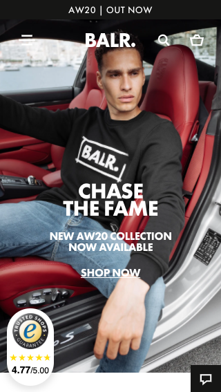

# Procesverslag
**Auteur:** -Abdelrahman Ahmed-

Markdown cheat cheet: [Hulp bij het schrijven van Markdown](https://github.com/adam-p/markdown-here/wiki/Markdown-Cheatsheet). Nb. de standaardstructuur en de spartaanse opmaak zijn helemaal prima. Het gaat om de inhoud van je procesverslag. Besteedt de tijd voor pracht en praal aan je website.

## Bronnenlijst
1. MDN
2. CSS-tricks

Bijgaand alle bronnen die ik gebruikt of deels benut heb als inspiratie heb tijdens het coderen van mijn website

- [https://css-tricks.com/text-blocks-over-image/](https://css-tricks.com/text-blocks-over-image/). **Code voor tekst op een afbeelding**
- [https://css-tricks.com/zooming-background-images/](https://css-tricks.com/zooming-background-images/) **Code voor het inzoomen op een foto wanneer je er overheen hovert**
- [https://stackoverflow.com/questions/24293102/how-to-put-a-background-video-loop-on-a-website-html-css](https://stackoverflow.com/questions/24293102/how-to-put-a-background-video-loop-on-a-website-html-css) **Code voor het plaatsen en loopen van een video op je website**
- [https://stackoverflow.com/questions/17042201/how-to-style-input-and-submit-button-with-css](https://stackoverflow.com/questions/17042201/how-to-style-input-and-submit-button-with-css) **Code voor het stylen van mijn input en sumbit knop met css**
- [https://www.jotform.com/help/118-how-to-customize-the-submit-button-with-css](https://www.jotform.com/help/118-how-to-customize-the-submit-button-with-css) **Code voor het stylen van mijn submit knop**
- [https://stackoverflow.com/questions/46986859/how-can-i-put-elements-underneath-each-other-in-flex-display](https://stackoverflow.com/questions/46986859/how-can-i-put-elements-underneath-each-other-in-flex-display) **Code om elementen onder elkaar te krijgen met display flex**
- [https://css-tricks.com/guide-responsive-friendly-css-columns/](https://css-tricks.com/guide-responsive-friendly-css-columns/) **Code voor responsive css kolommen**
- [https://css-tricks.com/snippets/css/complete-guide-grid/](https://css-tricks.com/snippets/css/complete-guide-grid/) **Complete grid gids**
- [https://developer.mozilla.org/en-US/docs/Web/CSS/flex-shrink](https://developer.mozilla.org/en-US/docs/Web/CSS/flex-shrink) **Code voor flex-shrink**
- [https://stackoverflow.com/questions/8919682/remove-all-styling-formatting-from-hyperlinks](https://stackoverflow.com/questions/8919682/remove-all-styling-formatting-from-hyperlinks) **Code voor het weglaten van alle standaard styling voor hyperlinks**
- [https://css-tricks.com/solved-with-css-dropdown-menus/](https://css-tricks.com/solved-with-css-dropdown-menus/) **Code voor dropdown menu**
- [https://stackoverflow.com/questions/2189452/when-to-use-margin-vs-padding-in-css#:~:text=The margin clears an area,vs margin if you can](https://stackoverflow.com/questions/2189452/when-to-use-margin-vs-padding-in-css#:~:text=The%20margin%20clears%20an%20area,vs%20margin%20if%20you%20can). **Code met toelichting omtrent padding en margin**
- [https://codepen.io/abdelrahman-cmd/pen/bGwxMgd](https://codepen.io/abdelrahman-cmd/pen/bGwxMgd) **Code voor gebruik van hartje**
- [https://stackoverflow.com/questions/52493058/dropdown-is-hidden-behind-image](https://stackoverflow.com/questions/52493058/dropdown-is-hidden-behind-image) **Code voor z-index ivm het wijzigen van positie (nav voor de img)**
- [https://css-tricks.com/almanac/properties/s/scroll-snap-type/](https://css-tricks.com/almanac/properties/s/scroll-snap-type/) **Code omtrent de manier waarop de slider werkt.**
- [https://freefrontend.com/css-radio-buttons/](https://freefrontend.com/css-radio-buttons/) **Code voor het maken van de size labels**

https://developer.mozilla.org/en-US/docs/Web/JavaScript/Reference/Statements/let **Code voor het gebruiken van let**

https://developer.mozilla.org/en-US/docs/Web/CSS/CSS_Animations/Using_CSS_animations **Code voor animatie**

## Eindgesprek (week 7/8)

-dit ging goed & dit was lastig-

**Screenshot(s):**

-screenshot(s) van je eindresultaat-

## Voortgang 3 (week 6)

-same as voortgang 1-
Javascript lukt mij niet echt. De oefening op dlo waren tot het tweede blokje te volgen. Daarna ben ik echt in de knoop geraakt. Ik snap JS helemaal niet.

## Voortgang 2 (week 5)

-same as voortgang 1-
De oefeningen op dlo met flex box waren een beetje lastig. Ik raakte steeds in de knoop. Hierdoor heb ik altijd de neiging gehad om na 3 of 4 pogingen de uitwerkingen erbij te pakken. 

## Voortgang 1 (week 3)

### Stand van zaken

-dit ging goed & dit was lastig-
Ik heb veel moeite met het toepassen van de juiste css. HTML is nog steeds een beetje verwarrend voor mij.

De breakdownschets ging wel goed tijdens het anaylseren van de BALR website.

**Screenshot(s):**

-screenshot(s) van hoe ver je bent met korte uitleg-

### Agenda voor meeting

-samen met je groepje opstellen-

| student 1      | student 2          | student 3    | student 4        |
| ---            | ---                | ---          | ---              |
| dit bespreken  | en dit             | en ik dit    | en dan ik dat    |
| an dat ook nog | dit als er tijd is | nog een punt | dit wil ik zeker |
| ...            | ...                | ...          | ...              |

### Verslag van meeting

-na afloop snel uitkomsten vastleggen-

## Breakdownschets (week 1)

-uitwerken voor de 1e werkgroep - eind van de eerste week-

## Intake (week 1)
-uitwerken voor de kick-off werkgroep - begin van de eerste week-

**Je startniveau:** -kies uit zwart, rood óf blauw-

Blauw

**Je focus:** -kies uit responsive óf surface plane-

Responsive

**Je opdracht:** -link naar de website die je gaat namaken óf de naam van je eigen ontwerp-

Website: https://www.balr.com/

**Screenshot(s) van de eerste pagina (small screen):**

**Screenshot(s) van de tweede pagina (small screen):**

Format: 

